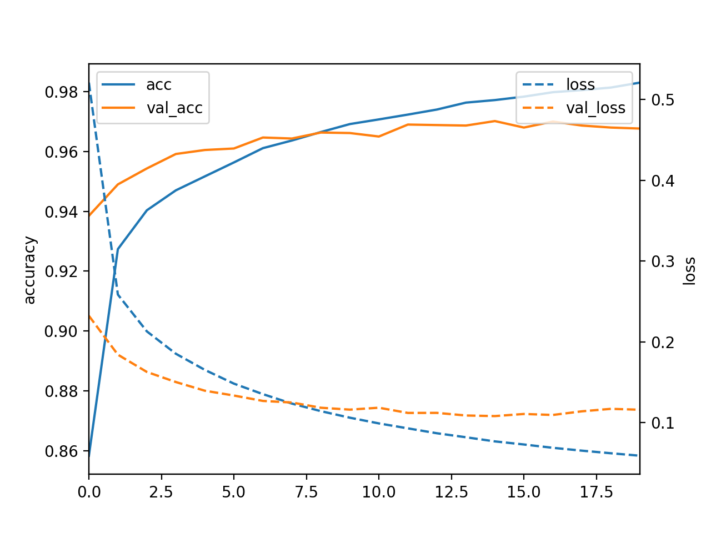
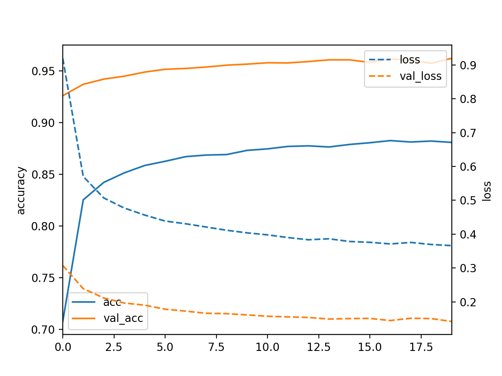
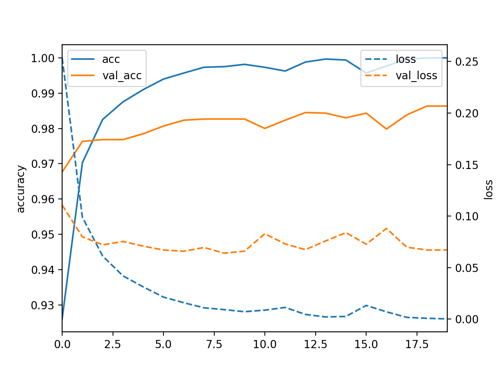
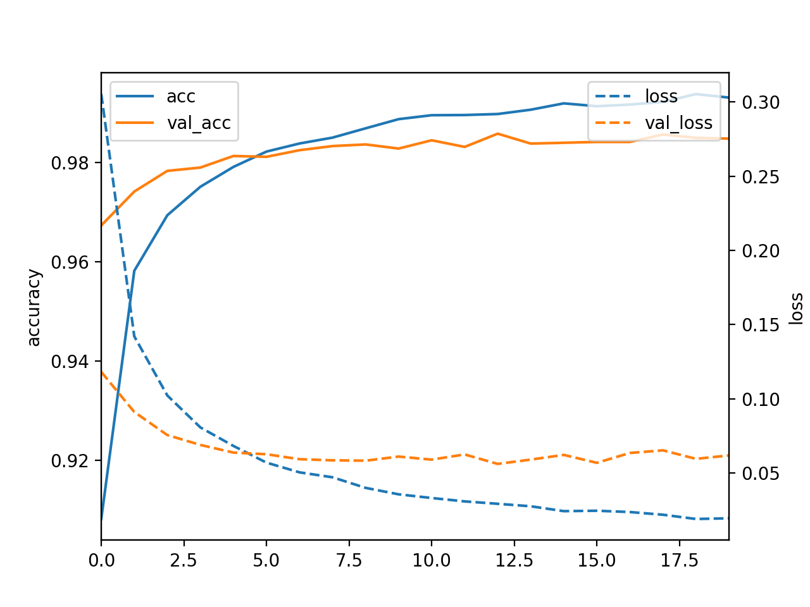
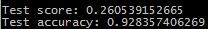

# Neural Network on MNIST and SVHN dataset
## Author: Zhifu Xiao
## Date: 04/27/2017

This is a learning project using the keras Sequential interface. 

## Task 1
In the first task, I ran a multilayer perceptron (feed forward neural network) with two hidden layers and rectified linear nonlinearities on the iris dataset using the keras Sequential interface. From the basic model, we got test loss 0.775 and test accuracy 0.684 while evaluating the independent test set.

Then we did grid search and found the best sizes of the hidder layers, we set the numbers of nuerons as 19 and 9 on the first
and second layer respectively.

At last, we got test loss 0.229 and test accuracy 1.000 using the new model with best parameters.

## Task 2

In the second task, I traiedn a multilayer perceptron on the MNIST dataset and compared this model using drop-out with a “vanilla” model.  The basic "vanilla" model gave the validation accuracy around 0.96, and the validation accuracy was not increased using drop-out on the "vanilla" model. 

Using grid-search and choosing the best parameter, the result is slightly increased to 0.98, and with drop-out, the model loss decreases consistently with slightly improved accuracy on validation data.

## Task 3

In the third task, I trained a convolutional neural network on the SVHN dataset in format 2 (single digit classification). The validation accuracy using a three-layer ConvNet is 92.8%.

