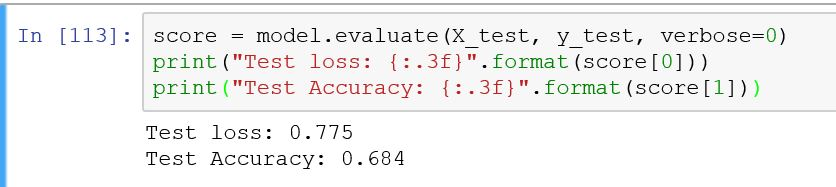

# Neural Network on MNIST and SVHN dataset
## Author: Zhifu Xiao
## Date: 04/27/2017

This is a learning project using the keras Sequential interface. 

## Task 1
In the first task, I ran a multilayer perceptron (feed forward neural network) with two hidden layers and rectified linear nonlinearities on the iris dataset using the keras Sequential interface. From the basic model, we got test loss 0.775 and test accuracy 0.684 while evaluating the independent test set.

Then we did grid search and found the best sizes of the hidder layers, we set the numbers of nuerons as 19 and 9 on the first
and second layer respectively.
At last, we got test loss 0.229 and test accuracy 1.000 using the new model with best parameters.

## Task 2

## Task 3

## Task 4
