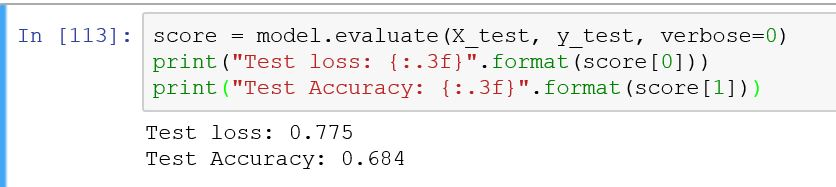
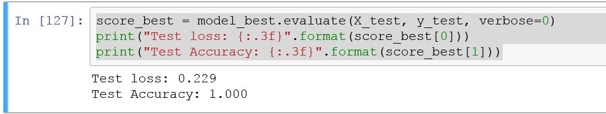

## Performance of Task 1

From the basic model, we got test loss 0.775 and test accuracy 0.684 while evaluating the independent test set.

Then we did grid search and found the best sizes of the hidder layers, we set the numbers of nuerons as 19 and 9 on the first
and second layer respectively.
At last, we got test loss 0.229 and test accuracy 1.000 using the new model with best parameters.

